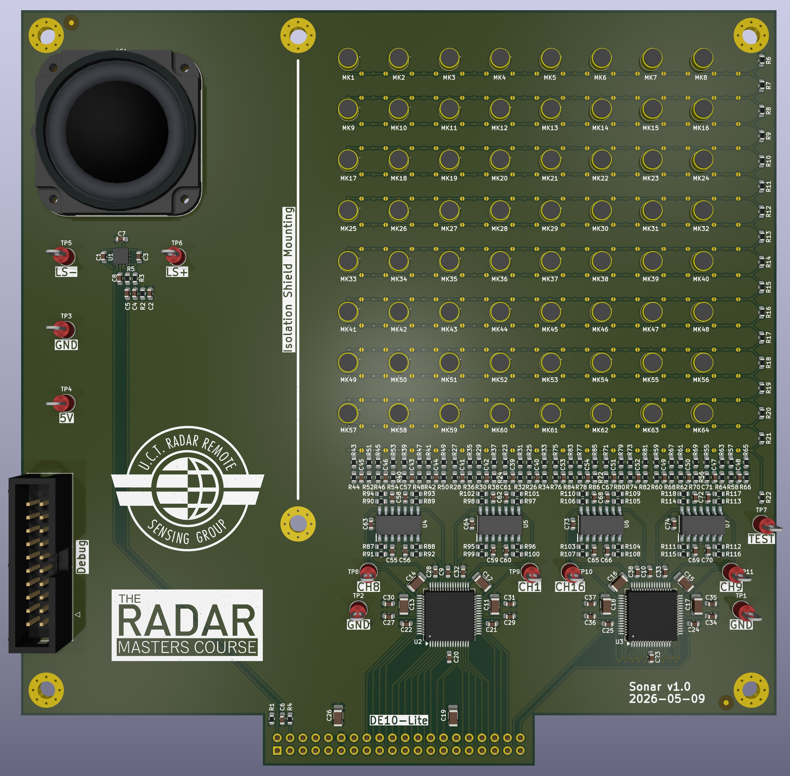
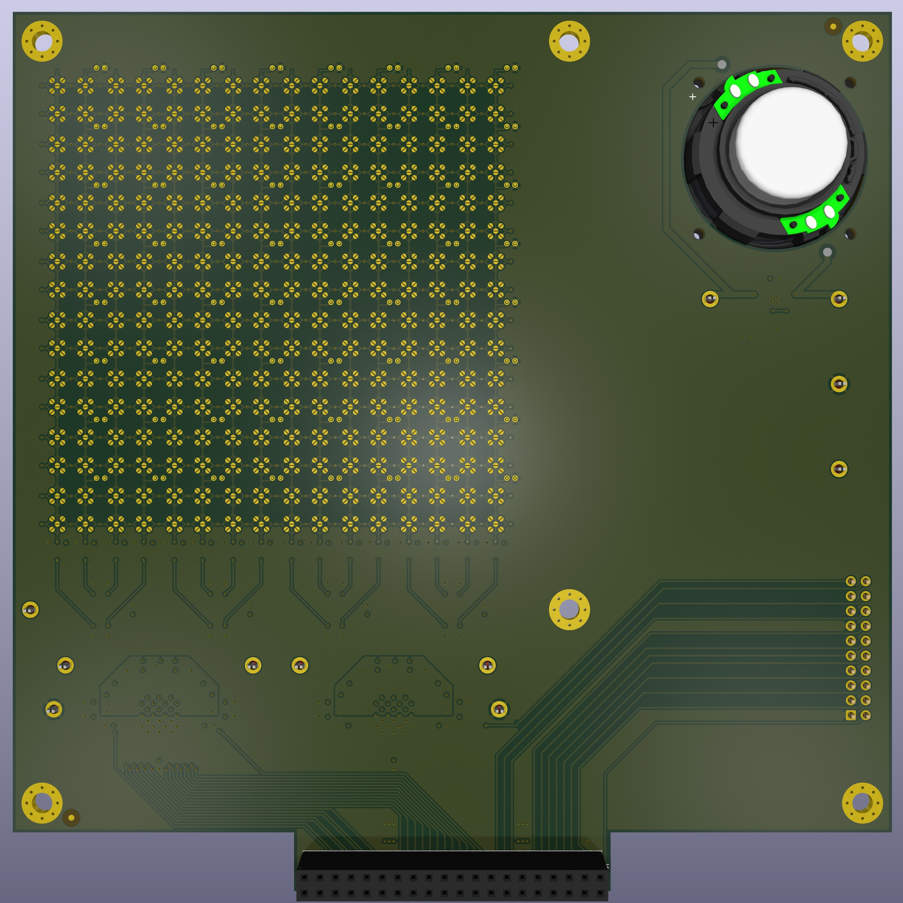
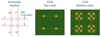
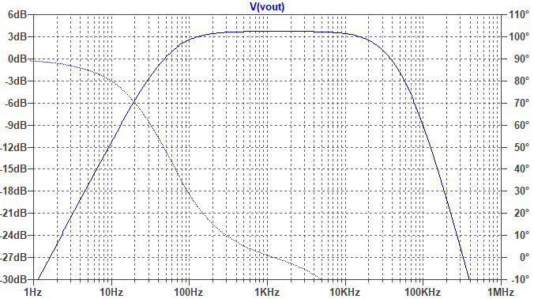
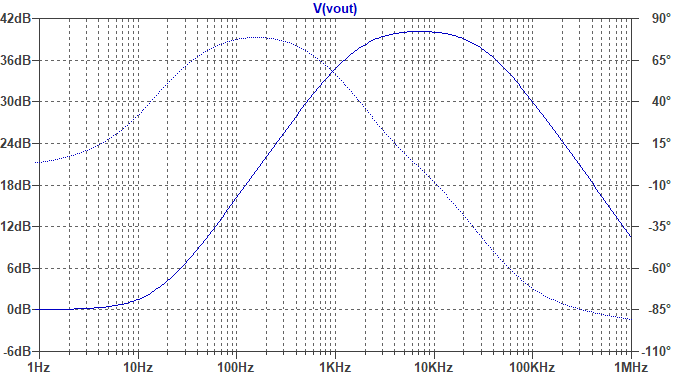
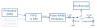

# Practical &ndash; PWM and Data Injection

Prerequisite: Day 4 lectures

This practical implements the PWM and data injection modules.

> [!NOTE]
> Be considerate to your fellow students in the lab.  A sonar is a noisy thing,
> so keep the noise to a minimum.  When generating a synthesised waveform, use
> frequencies above 10 kHz and limit the volume when high transmit power is not
> required.  Hook up the PA_Enable to a slide-switch so that you can disable it.

--------------------------------------------------------------------------------

## Sonar PCB

Familiarise yourself with the [Sonar PCB](https://github.com/jpt13653903/Sonar/tree/v1.0).

> [!CAUTION]
> The Sonar PCB is a prototype, and therefore not foolproof.  You can break it.
> Please double-check your pin mapping, voltages etc. before connecting the
> DE10-Lite to the Sonar PCB.

Make sure you understand
[the schematic](https://github.com/jpt13653903/Sonar/blob/v1.0/KiCAD/CAM/Sonar.pdf),
especially the routing network.

Also note the frequency response of the speaker driver and microphone amplifier.

 
Speaker Driver Frequency Response

 
Microphone Amplifier Frequency Response

--------------------------------------------------------------------------------

## PWM Module

- Write a PWM module (optionally with noise shaping)
- Use a 100&nbsp;MHz master clock and 390.625&nbsp;kHz PWM (8-bit)
- Simulate the PWM module to verify functionality

--------------------------------------------------------------------------------

## Simple Injection Module

- Pre-load a RAM block ($2^{16}$ &times; 16-bit) with
  [the MIF file provided](../Modules/AudioInjection/Audio.mif).
  It contains audio, generated by means of the
  [convert.py script](../Modules/AudioInjection/convert.py)
- Play back the RAM block data through the PWM module; Inject at 48.828&nbsp;125&nbsp;kSps

--------------------------------------------------------------------------------

## SDRAM Injection Module

- Move data injection to the external memory
- Use the RAM block as a FIFO cache (after reducing the size to 1024 words)

- Add the provided [`VirtualJTAG_MM.v`](../Modules/SDRAM_Loader/VirtualJTAG_MM.v)
  module to the project and create an instance in the top-level entity.
- Connect the Avalon interface of this module to the `Master` interface
  of the Qsys instance.
- Use the provided [`convert.py`](../Modules/AudioInjection/convert.py)
  Python script to create a test data file.
- Use the provided [`WriteData.tcl`](../Modules/SDRAM_Loader/WriteData.tcl)
  TCL script to load data into the memory (the transfer takes between 2&nbsp;and
  5&nbsp;minutes &ndash; it is useful to display the high bits of the SDRAM address
  on the LEDs as a progress indication).
- Read the source code of these 3&nbsp;parts and make sure you understand what each
  does &ndash; ask if you don't.
- You can use the same QSys `Master` interface to read the SDRAM, but make
  sure that you never try to read and write at the same time.  Alternatively,
  create a new master in the QSys specifically for reading.  Or you can write
  your own arbiter.
- If you like, you can wrap the TCL interface in Python by using the
  [`quartustcl`](https://github.com/agrif/quartustcl) package.

> [!TIP]
> You might need to install `ffmpeg` for `convert.py` to work.
> You can do this in Windows with `winget install ffmpeg`.

> [!NOTE]
> You need to add `quartus_stp` to your system path.
> The typical path is `C:\altera_lite\25.1std\quartus\bin64`.

> [!IMPORTANT]
> The mp3's provided are licensed under CC BY and therefore free to use.
> You may, however, use your own mp3, just don't publish it without permission.
--------------------------------------------------------------------------------

## Audio Player

You now have all the infrastructure in place to make an audio player.

As it stands at the moment, you can typically load only one song into the SDRAM
at a time.  If you feel like a challenge, update the interface to support
continuous streaming from the PC.  It must implement flow control, but it only
has one JTAG connection, which makes this task quite the puzzle.

--------------------------------------------------------------------------------

