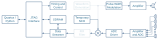

# Practical &ndash; ADC and Digital Downconversion

Prerequisite: Day 4 lectures

This practical uses the two 8-channel ADC ICs to sample some analogue
waveforms, digitally downconverts those samples and streams the result to the
PC for further analysis.

You'll need to solder some links of the routing network so that some of the ADC
inputs are driven (typically by the resistor-ladder test circuit on the side of
the PCB).

Don't link up all the channels, because you'll need to remove them afterwards.

--------------------------------------------------------------------------------

## ADC Driver

You are encouraged to write your own ADC driver eventually, but in the interest
of time use the [one provided](../Modules/ADC%20Driver/MAX11059.v).

Create an instance of the ADC driver and hook it up to the ICs.
Set a sampling rate of 97.65625 kSps.

Use the resistor-ladder to inject signals and make sure that it's working by
whatever method you prefer (e.g. SignalTap, playing the signal out the speaker, etc.)

--------------------------------------------------------------------------------

## Digital Downconversion

Implement a complex NCO (97.65625 kSps, 12-bit phase, 9-bit amplitude)
and verify through simulation.

Then mix (multiply) the real input from the ADC with the complex output of the NCO.
Sub-sample the result by a factor of 256.

--------------------------------------------------------------------------------

## Output Stream

The sampling rate at this point is very low, so transfer to the PC can happen
by means of internal memory.  This said, it would be advantageous to use the
external memory instead, so that you can sample for longer at a time.

Trigger a set sample size, after which the PC can download the resulting log.
A second or two worth of data is plenty.  Plot the result in Python.

--------------------------------------------------------------------------------

## Control

Everything can be hard-coded for now.
Register-based control is added in the next practical.

--------------------------------------------------------------------------------

