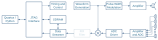
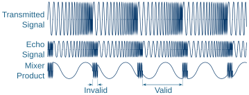

# Practical &ndash; Waveform Generation

Prerequisite: Day 5 lectures

This practical implements the FMCW waveform required by the sonar.

--------------------------------------------------------------------------------

## Ramp Generation

Extend the NCO from the digital downconversion of the previous practical to
include a ramp generator.  Use the following parameters:

- 3.6&nbsp;kHz bandwidth (i.e. 10&nbsp;kHz start and 13.6&nbsp;kHz stop frequencies)
- Sweep for about 100&nbsp;ms (the final processing will only use about 84&nbsp;ms of
  this, resulting in 3&nbsp;kHz sonar bandwidth)
- Don't sweep up and down, sweep up and step down.

--------------------------------------------------------------------------------

## Timing Generator

As part of the process, you'll need to implement a timing generator to ensure
that everything happens at the correct times.

- The sweep must be triggered regularly with equal spacing between sweeps
- The "valid" samples must be the same ones every sweep
- etc.

--------------------------------------------------------------------------------

## Logging

Use the same logging infrastructure from the previous practical.
Log a set number of sweeps (16&nbsp;would be a good number).

You should not log the invalid samples.  In other words, don't log while the
transient is still travelling to the target and back.  Only log the last
32&nbsp;samples (about 84&nbsp;ms) of each sweep.

--------------------------------------------------------------------------------

## Control

Place all the required parameters under register control, with the above as
default.  The log should be software triggered so that the PC can ask for a
burst (of sweeps), and then download the result afterwards.

>[!TIP]
> You can connect to the JTAG Master Bridge and Virtual JTAG at the same time,
> as long as you do not try to lock the device at the same time.

--------------------------------------------------------------------------------

## Microphone

Once you have everything working, solder in a microphone and make sure it's
working.  Set the digital processing chain to use the microphone as input.

--------------------------------------------------------------------------------

