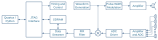

# Practical &ndash; FIR Filter

Prerequisite: Day 5 lectures

This practical implements the finite impulse response filter.

This removes the high frequency component from the mixing process.

--------------------------------------------------------------------------------

## Filter Parameters

Typical filter parameters are:

- 2048-point FIR filter that decimates by 256
  (i.e. one sample output for every 256&nbsp;samples input)
- The FIR filter should run on the 100&nbsp;MHz clock,
  with a new sample from the ADC every 10.24 μs
- Use a cut-off frequency of 300&nbsp;Hz and a
  [Hann window](https://en.wikipedia.org/wiki/Window\_function\#Hann\_window) 
  $w(n) = \sin^2\left(\frac{\pi n}{N-1}\right)$

>[!TIP]
> You have sufficient clock cycles between input ADC samples to perform all
> required calculations in a leisurely fashion.  Do not waste resources if
> you don't need to.

--------------------------------------------------------------------------------

## Design Workflow

- Design the FIR filter in Matlab / Python / Whatever and test using integer values
- Check for overflows, rounding problems, etc.
- Design what bit-widths to use, given the native RAM and DSP elements of the FPGA in question
- Use Matlab / Python / Whatever to generate the FIR filter constants and MIF file
- Verify through simulation
- Implement and integrate the FIR filter into the design, and test the system as a whole

--------------------------------------------------------------------------------

## Sonar

Once the FIR filter is working, you should have a working sonar.
The intended sequence of events are:

1. The PC triggers a burst (you can trigger a burst by reading the previous)
2. The FPGA performs a log of $N$ sweeps (you can let the PC wait a fixed time,
   or get the FPGA to tell you when it's done)
3. The PC downloads the log
4. The PC then performs further processing (e.g. the range-FFT) and plots the result
5. Repeat from step 1

--------------------------------------------------------------------------------

